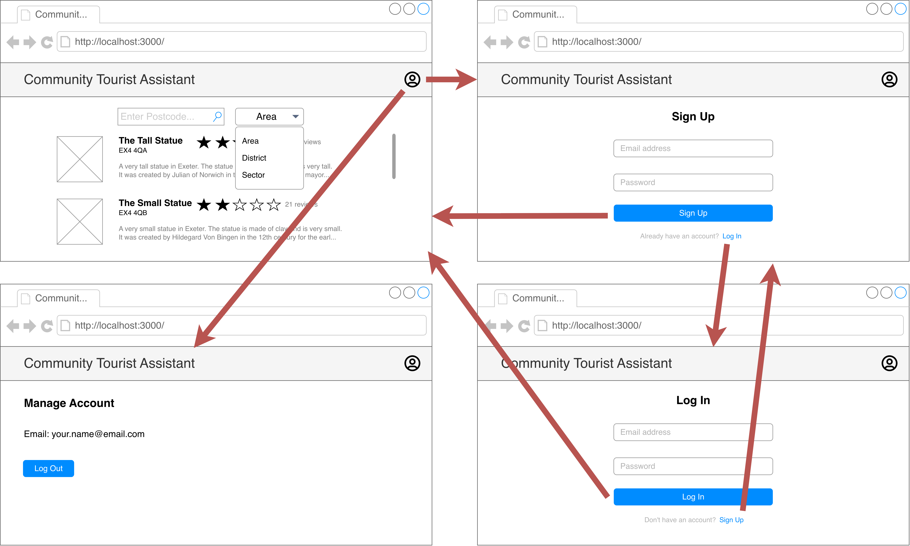
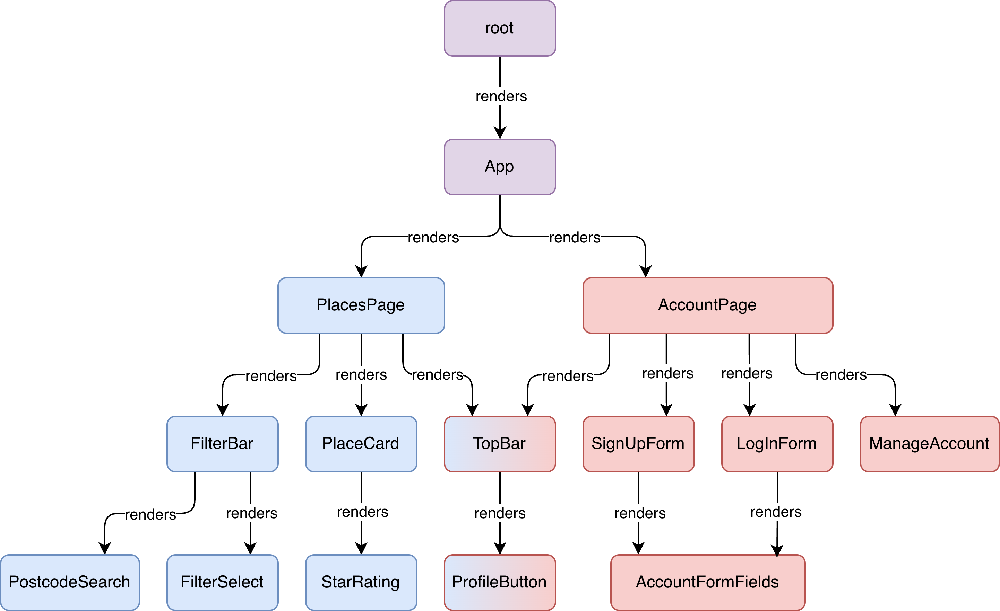
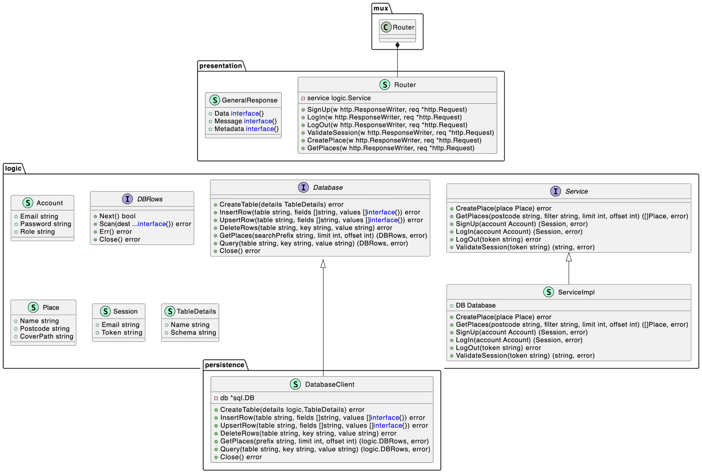
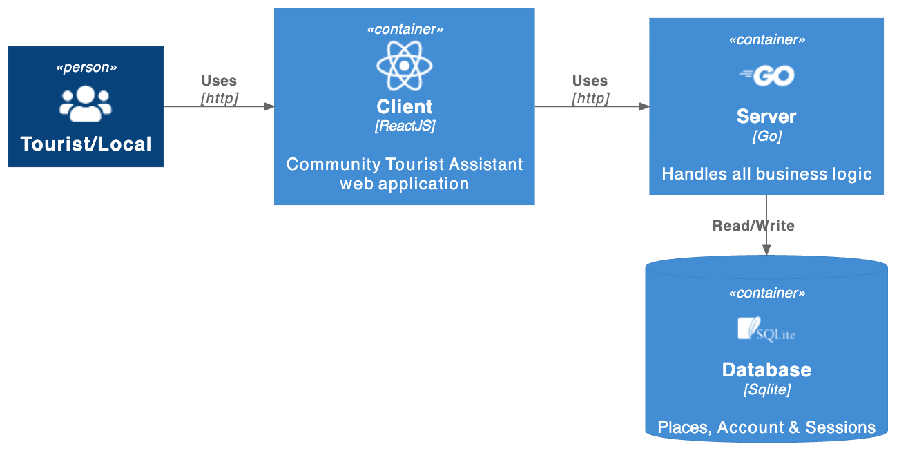
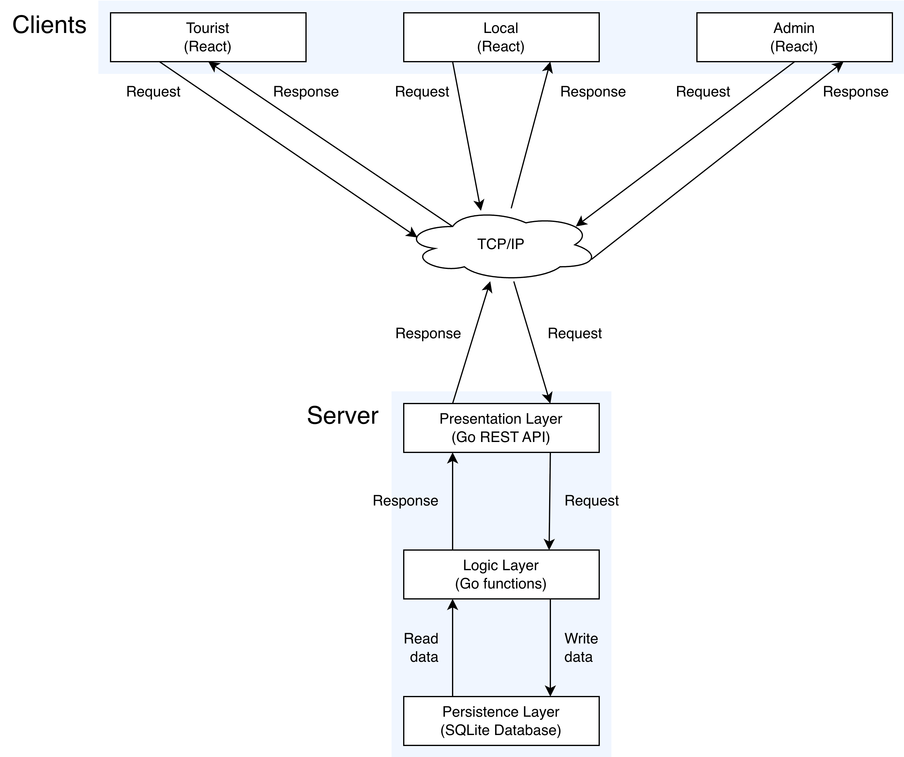
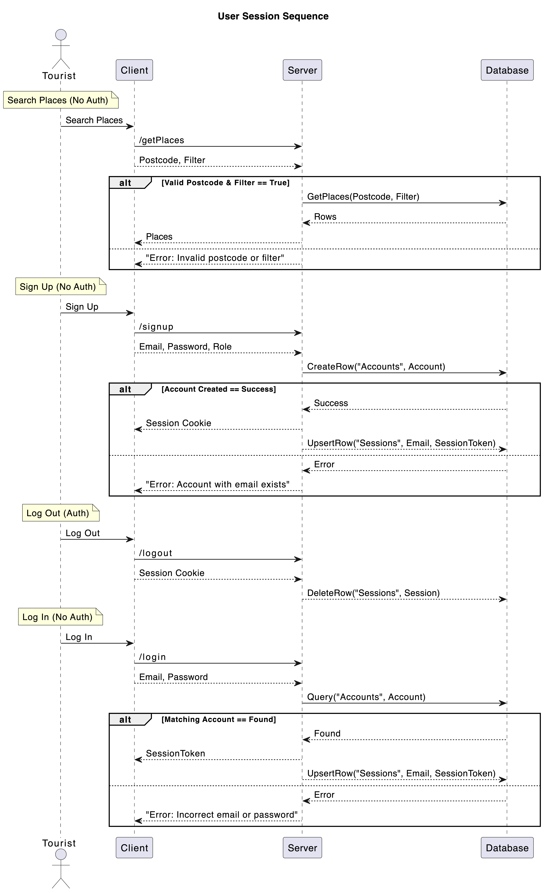

# Community Tourist Assistant

## About

### Outline

This project proposes a new social platform, Community Tourist Assistant.
Community Tourist Assistant will allow visitors to a region to identify interesting places and activities.
Information on the platform will be crowd-sourced by locals and tourists alike.

### Objectives

- Centralise tourist information.
- Reduce the overhead for stakeholders of local tourism.
- Encourage profitable tourism through community engagement, such as ratings.
- Increase the length of time visitors stay, by presenting a wide range of sites and activities.
- Publicise niche and ever-changing tourist attractions in a scalable manner.

## Deploy

Follow these instructions to host the project:

1. Download the latest release .zip file
2. Navigate into the extracted directory
3. Run the server
   - Windows: Run `server-amd64-windows.exe`
   - Linux: Run `./server-amd64-linux`
     MacOS: Run `./server-arm64-macos`
4. In another terminal, run the client:
   1. Run `npm install -g serve`
   2. Run `serve -s client -l 3000`
5. Go to [http://localhost:3000](http://localhost:3000)

## Architecture

### Client

UI Design

> 

Components Tree

> 

### Server

Class Diagram

> 

### Integration

Deployment Diagram

> 

Network Architecture

> 

Sequence Diagram

> 
